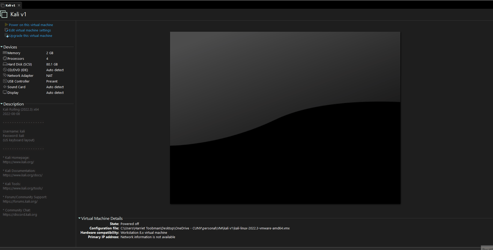
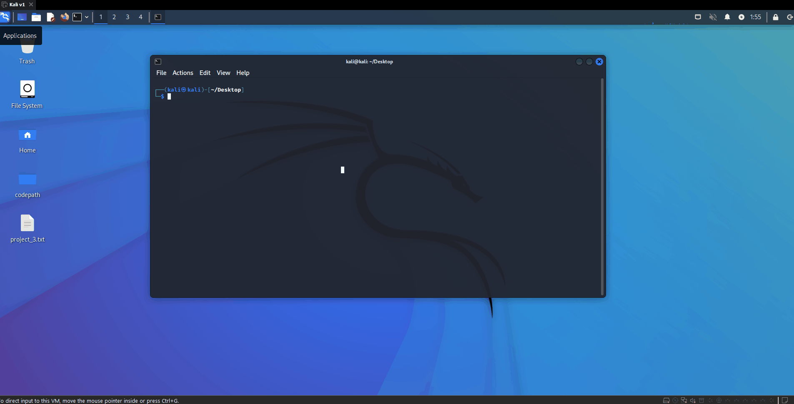

# Project 3 - VirtualBox and Kali

```bash
name="Ricardo Ramirez"
univ="John Jay of Criminal Justice"

screenfetch
echo $name'@'$univ
```

### Installing VirtualBox and Kali


 
### Running screenfetch


